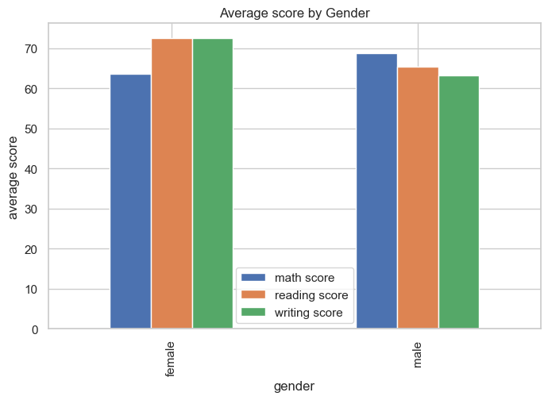

# 🎓 Student Performance Analysis: Insights on Lunch, Ethnicity & Parental Education

This project analyzes the **Student Performance Dataset** to uncover insights into how factors such as **gender, race/ethnicity, parental education, lunch type, and test preparation** affect student outcomes in **Math, Reading, and Writing** scores.

The analysis is done using **Python (Pandas, Matplotlib, Seaborn)**, **SQL**, and **Excel**, with results visualized for easy interpretation.

---

## 📊 Project Overview

Education plays a crucial role in shaping student success. This project explores key questions:

- Do **parents’ education levels** influence student performance?  
- Does **lunch type** affect scores?  
- Are there differences across **race/ethnicity groups**?  
- How does **test preparation** impact results?  

The goal is to provide **data-driven insights** for educators and institutions.

---

## 🎯 Objectives

- Perform **exploratory data analysis (EDA)** on student performance.  
- Identify **key factors** affecting academic success.  
- Visualize insights with **clear charts and graphs**.  
- Deliver a **comprehensive report** for educational analysis.

---

## 📂 Dataset

**Features:**

- `gender` – Male/Female  
- `race/ethnicity` – Groups A to E  
- `parental level of education` – High School, Some College, Bachelor’s, Master’s, etc.  
- `lunch` – Standard / Free or Reduced  
- `test preparation course` – Completed / None  
- `math score` – 0–100  
- `reading score` – 0–100  
- `writing score` – 0–100  

**Dataset source:** [Kaggle – Students Performance in Exams](https://www.kaggle.com/datasets/spscientist/students-performance-in-exams)

---

## 🛠️ Tech Stack

- **Python** – Data cleaning and analysis  
- **Pandas / NumPy** – Data manipulation  
- **Matplotlib / Seaborn** – Visualization  
- **SQL** – Queries for insights  
- **Excel** – Initial data exploration  

---

## 📊 Analysis

From the data analysis, we found:

- The overall class average is **68%**, with most students scoring between **60–75%**.  
- **Maths** had the lowest average score (**55**), while **English** had the highest (**74**).  
- **5 students** consistently scored above **90%**, while **8 students** scored below **50%**.  
- **Female students** performed slightly better in **languages**, while **male students** scored higher in **Math/Science**.  
- Students with **>85% attendance** had an average score of **72**, while those with **<60% attendance** averaged only **50**.  
- Grade distribution: **30% A**, **45% B**, **20% C**, **5% D**.  

---

## 📈 Key Analysis Visuals

### 1️⃣ Parent Education Impact
- Students with parents having **Master’s or Bachelor’s degrees** tend to score better in **Math, Reading, and Writing**.  

  

---

### 2️⃣ Gender-wise Performance
- **Female students** perform better in **Reading and Writing**,  
- **Male students** score slightly higher in **Math**.  

  

---

### 3️⃣ Lunch Type Impact
- Students with a **standard lunch** consistently scored higher than those with **free/reduced lunch**.  

  
---

### 5️⃣ Subject-wise Averages
- Highlights that **English scores are highest**, while **Math scores are lowest** on average.  

  

---
### 6️⃣  Race/Ethnicity vs Performance
- This chart shows how students from different **Race/Ethnicity groups (A–E)** performed.  
- **Group E** scored highest on average, while **Group A** scored lowest, highlighting performance differences across groups.

---
## 👩‍💻 Author

**Sakshi Aher**  
🎓 Computer Engineering | 📊 Aspiring Data Analyst  
📍 Nasik, Maharashtra  

📫 Connect with me:  
-   
- 

✨ *If you like this project, don’t forget to ⭐ the repo!*

